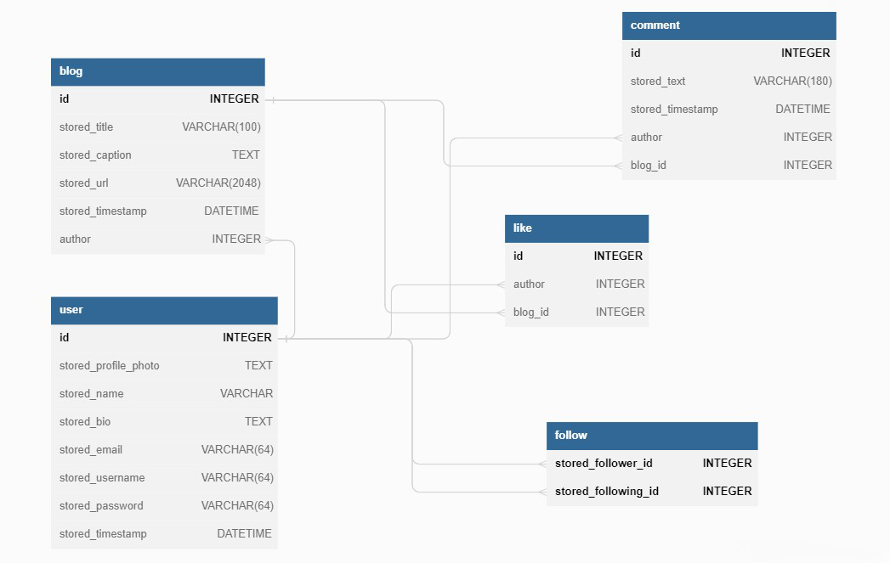

# BlogLite

## Description
BlogLite is a multi-user app kind of social media platform used for uploading blogs with
images, like and comment other user blogs, follow and unfollow other users, get user feed
and profile


## Technologies used
- [Flask](https://flask.palletsprojects.com/en/2.2.x/): Flask is a web framework used for developing web applications using python. We used it for basic backend Implementation.
- [Flask_sqlalchemy](https://flask.palletsprojects.com/en/2.2.x/patterns/sqlalchemy/): Flask-SQLAlchemy is an extension for Flask that adds support for SQLAlchemy to your application.
- [Datetime](https://docs.python.org/3/library/datetime.html): for storing the date and time.
- [jinja2](https://jinja.palletsprojects.com/en/3.1.x/): It is a text-based template language and thus can be used to generate any markup as well as source code
- [render_template](https://flask.palletsprojects.com/en/2.2.x/quickstart/#rendering-templates): render_template is a Flask function that typically imported directly from the flask. It is used to generate output from a template file based on the Jinja2 engine that is found in the application's templates folder Some libraries imprender_template, redirect, and url_for displaying HTML content
- [flash](https://flask.palletsprojects.com/en/2.2.x/patterns/flashing/): Flask provides a really simple way to give feedback to a user with the flashing system. WE used this to show an alert in webpage
- [Flask_Login](https://flask-login.readthedocs.io/en/latest/): Flask-Login provides user session management for Flask. It handles the common tasks of logging in, logging out, and remembering your users’ sessions over extended periods of time.
- [werkzeug.security](https://werkzeug.palletsprojects.com/en/2.2.x/utils/#module-werkzeug.security): for hashing the password 
- [Flask-Restful](https://flask-restful.readthedocs.io/en/latest/): Flask-RESTful is an extension for Flask that adds support for quickly building REST APIs. 


## API Design
There are two API:
- UserAPI
    - It is linked to two endpoints:
        - /api/user – With this endpoint, we can get all users in database, creating user.
        - /api/user/<int:id> – With this endpoint, we can get user with input id,updating user with respective id,deleting user with respective id.
- BlogAPI
    - It is linked to three endpoints:
        - /api/blog/<int:blog_id> – With this endpoint, we can get all blog with respective id from database
        - /api/user/<int:user_id>/blog/<int:blog_id> – With this endpoint, we can get blog with respective id under respective user, delete blog with respective id under respective user, update blog with respective id under respective user
        - /api/user/<int:user_id>/blog – With this endpoint, we can create blog under respective user
- Note: Basic API's are created and it is not linked with the project


## DB Schema Design


## Architecture and Features
- There are 2 controllers
    - __auth__: It is used for authorization purpose
    - **view**: It is used for all other purpose like blogs, profile, comment, like, follower etc.
- There are 2 folders
    - **static**: It contains some CSS files and images
    - **templates**: It contains all HTML templates used in Project.
- **login / sign-up system**: Here user can fill in all details for creating a new account and after that user will be able to do login.
- **Profile view with basic stats**: This page has user details, number of blogs he/she created, number of followers, and number of following.
- **Blog Post Management**: Here user will be able to create, update blog and delete blog with user confirmation
- **Search**: Here the user will be able to search a user with his/her username which consists of that keywords.
- **Follow/Unfollow**: Here the user will be able to follow user and unfollow user
- **User Feed**: This page shows the user feed which consists of blogs from other user whom the user follows
- **Additional features**: Additional features include
    - **Followers page**: Here the user will be able to see the list of his/her followers
    - **Following page**: Here the user will be able to see the list of people whom the user follow
    - **Like**: Here the user will be able to like blogs, remove his like
    - **Comment**: Here the user will be able to create, delete comment
- **API**: Created two API- user, blog with basic functionality


# Installation


Use the package manager [pip](https://pip.pypa.io/en/stable/) to install foobar.

```bash
pip install -r requirements.txt
```

# Local Development Run

- Simply run `python main.py` , it will initiate the flask app in development.

# Replit run

- Click on `main.py` and click button run
- The web app will be available

# Folder Structure

- `instance` has the `blog_app.db` DB.
- `static` has the all css files and Images.
- `templates` has all the html template files.

```

├─  main.py
├─  instance───blog_app.db
├─  readme.md
├─  websites
|        ├───all_api
|        |      ├───blogs_api.py
|        |      ├───user_api.py
|        |      └── validation.py
│        ├───static
|        |     ├─ blogs
|        |     ├─ profiles
|        |     └── styles.css
|        ├───templates
|        |       ├─ base.html
|        |       ├─ blogs_div.html
|        │       ├─ create_blog.html
|        │       ├─ edit_blog.html
|        │       ├─ edit_profile.html
|        │       ├─ feed.html
|        │       ├─ login.html
|        |       ├─ profile.html
|        |       ├─ search.html
|        |       ├─ sign-up.html
|        │       ├─ user_blogs.html
|        |       ├─ user_followers.html
|        |       ├─ user_following.html
|        |       └── user_view.html
│        ├─ auth.py
|        ├─ models.py
│        └── views.py
|
|
└───requirements.txt
```

